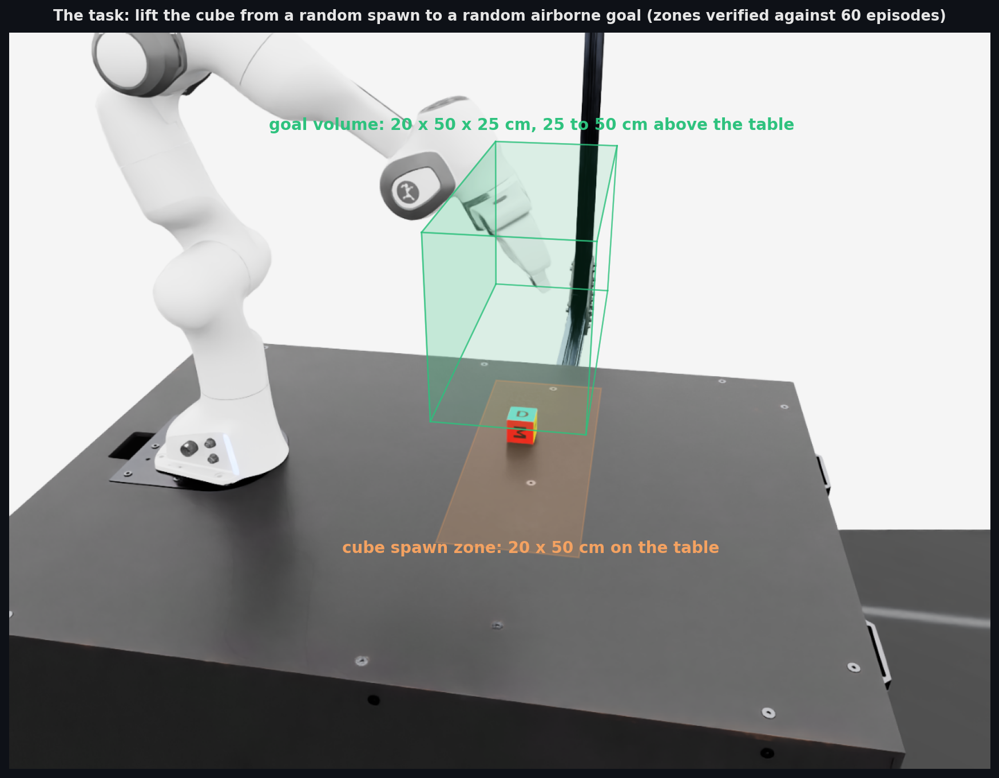
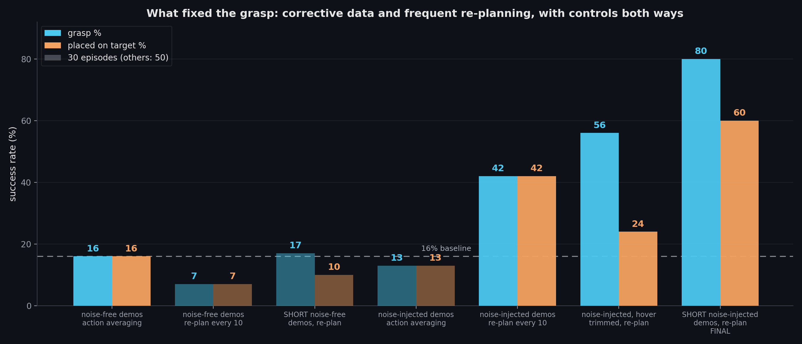
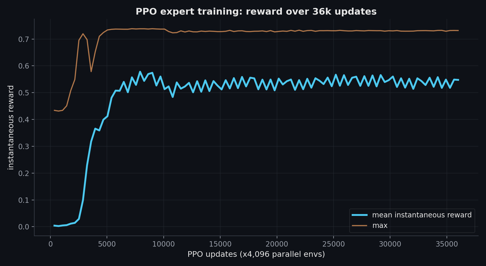
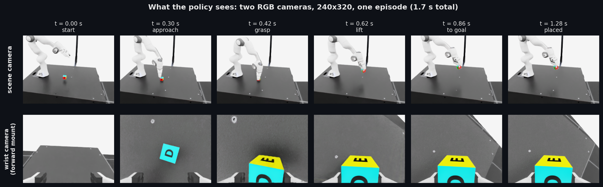
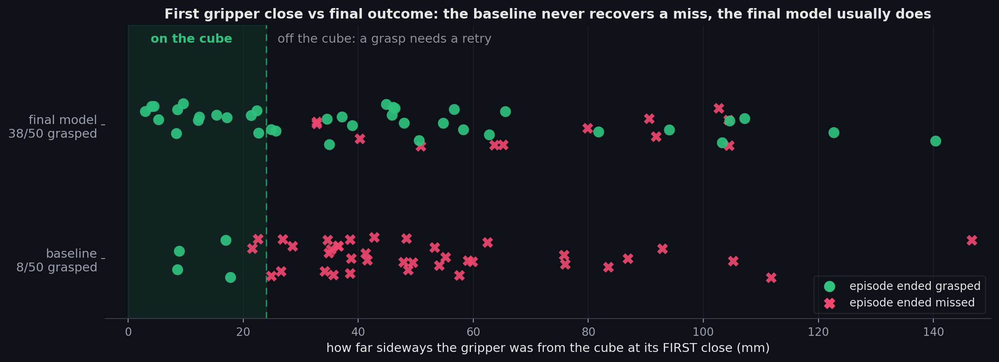
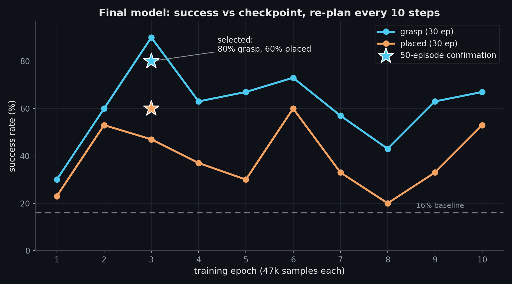

# Franka Panda: pick-and-place from pixels

A Franka Panda learns to grasp a cube and place it on a randomized airborne target,
from two cameras plus proprioception, in Isaac Lab. A state-based PPO expert generates
demonstrations; an ACT (Action Chunking Transformer) vision policy is distilled from
them. Getting the student from 0% to 80% grasp / 60% placed came down to two
instrumented findings: a missing goal input, and missing corrective data that the
default inference mode was hiding.


*Final model, two successful episodes: scene camera with the projected goal marker, wrist camera, the predicted 50-step action chunk with the executed 10-step prefix in blue, and the gripper channel.*



## Results

| demos | action averaging | re-plan every 10 |
| --- | --- | --- |
| noise-free, long | 16% / 16% (50 ep) | 7% / 7% |
| noise-free, short | 7% / 7% | 17% / 10% |
| noise-injected, long | 13% / 13% | 42% / 42% (50 ep) |
| **noise-injected, short (final)** | 17% / 17% | **80% / 60% (50 ep)** |

*grasp % / placed-on-target %; 30 episodes unless marked.*



The factorial is controlled in every direction. Noise-injected data under action
averaging stays at 17% (corrections are learned but averaged away). Noise-free data
under re-planning stays between 7 and 17% even when collected short and task-dense,
and even though those models reach 3x lower training loss. The same final checkpoint
scores 17% or 80% grasp depending only on the inference mode. Only corrective data
plus re-planning works.

## Pipeline

**1. PPO expert.** skrl PPO on privileged state (36-D: joints, cube pose, goal, last
action; 8-D joint-position actions), 4,096 parallel envs, 36k updates, KL-adaptive LR.
Reward: reach, lift, goal tracking, plus an action-rate smoothness curriculum. It
grasps in 0.5 s and places reliably. Used only to generate demonstrations.




**2. Noise-injected demonstrations.** The data trick (`--noise_std`): execute the
expert action plus smooth noise on the arm joints, but store the clean expert action
as the label. The expert corrects every perturbation, so the demos densely cover
off-course states with corrective labels, which is exactly what imitation needs once
its own approach drifts a centimeter. Demos are collected short and task-dense
(3 s episodes, recording cut just after the goal is reached): about 1,000 demos /
31 demo-minutes in 35 min of sim.



**3. ACT student.** Vendored [ACT](https://github.com/tonyzhaozh/act) (DETR-VAE,
ResNet-18 backbones), two cameras plus 11-D proprioception: 7 joints, gripper, and
the placement goal. The goal is an invisible randomized command, so without it in the
inputs the policy is structurally blind to the target. That was the original 0% bug.
Chunk 50, lr 5e-5, 45 min on one L40S. Checkpoints are selected by closed-loop
evaluation, not loss.

**4. Inference: re-plan, do not average.** ACT's default temporal ensembling averages
about 50 overlapping action plans weighted toward the oldest, which smothers reactive
corrections. Re-planning every 10 steps (`--query_freq 10`) lets them through: the
same checkpoint jumps from 17% to 83% grasp on this switch alone.

## Diagnosis, before and after



Instrumented evaluation (`scripts/eval_grasp_taxonomy.py`) pinned the baseline failure:
it closes the gripper at the right time and height but a median 48 mm to the side, then
never retries. After recovery training the same instrumentation shows 38/50 grasped,
recoveries from first-closes over 100 mm off (the policy reopens and re-approaches),
and the remaining failures pushed out to a median 73 mm miss. A second dissociation
worth noting: the noise-free models reach 3 to 5x lower training loss while grasping
5 to 8x less, so checkpoints are selected by rollout evaluation, never by loss.



## Quickstart

```bash
git clone https://github.com/oliverkristianfritsche/FrankaPanda_Lift_with_ACT.git
cd FrankaPanda_Lift_with_ACT
/isaac-sim/python.sh -m pip install -e source/Lift   # act/ is vendored in-repo

# 1) train the PPO expert
/isaac-sim/python.sh scripts/skrl/train.py --task Template-Lift-Cube-Franka-v0 --headless

# 2) collect noise-injected demos (short, task-dense, two cameras)
/isaac-sim/python.sh scripts/generate_demos.py \
    --checkpoint logs/skrl/franka_lift/<run>/checkpoints/best_agent.pt \
    --target_minutes 12.5 --noise_std 0.3 --episode_seconds 3.0 --end_after_goal 25 --num_envs 16
#    repeat with --noise_std 0.45 (12.5 min) and without noise (6 min)

# 3) train ACT
/isaac-sim/python.sh scripts/train_act.py \
    --data 'data/demos/*.hdf5' --chunk_size 50 --batch_size 32 --lr 5e-5 --lr_backbone 5e-5 \
    --epochs 10 --save_freq 1 --sample_per_timestep

# 4) evaluate every checkpoint closed-loop, confirm the best at 50 episodes
/isaac-sim/python.sh scripts/eval_checkpoints.py --ckpt_dir logs/act/checkpoints/<run> \
    --query_freq 10 --episodes 30
/isaac-sim/python.sh scripts/eval_checkpoints.py --ckpt_dir logs/act/checkpoints/<run> \
    --ckpt checkpoint_000X.pt --query_freq 10 --episodes 50
```

## Repo layout

- `scripts/skrl/{train,play}.py`: PPO expert.
- `scripts/generate_demos.py`: noise-injected demo collection (clean labels, short episodes, incremental HDF5).
- `scripts/train_act.py`: ACT training (goal-conditioned inputs, per-timestep sampling).
- `scripts/eval_checkpoints.py`: grasp/placed success per checkpoint (averaging or `--query_freq`).
- `scripts/eval_grasp_taxonomy.py`: instrumented failure analysis (gripper-to-cube geometry at close).
- `scripts/record_policy.py`: rollout videos; `scripts/make_plots.py`: analysis figures.
- `act/`: vendored ACT (DETR-VAE), patched for `state_dim != action_dim`.
- `source/Lift/Lift/tasks/manager_based/lift/`: Isaac Lab task (env, rewards, cameras).
- `results/grasp_recovery/artifacts/`: raw evaluation and training records for every number above.

[Isaac Lab](https://isaac-sim.github.io/IsaacLab/) ·
[ACT paper](https://arxiv.org/abs/2304.13705) ·
[skrl](https://skrl.readthedocs.io/)
