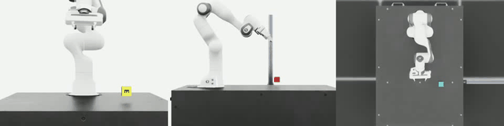

# Franka Panda Cube Lift

Cube lifting with Franka Panda using RL (PPO) and imitation learning (ACT) in Isaac Lab.



## Installation

### Option 1: Isaac Launchable (Cloud)

1. Deploy an [Isaac Launchable](https://brev.nvidia.com/launchable/deploy/now?launchableID=env-35JP2ywERLgqtD0b0MIeK1HnF46) (see [Isaac Launchable Repo](https://github.com/isaac-sim/isaac-launchable#quickstart-guide))
2. Open a terminal and run:

```bash
cd /workspace
git clone https://github.com/oliverkristianfritsche/FrankaPanda_Lift_with_ACT.git
cd FrankaPanda_Lift_with_ACT
git clone https://github.com/tonyzhaozh/act.git
/isaac-sim/python.sh -m pip install -e source/Lift
```

### Option 2: Local Installation

1. Install [Isaac Sim](https://docs.isaacsim.omniverse.nvidia.com/latest/installation/index.html) and [Isaac Lab](https://isaac-sim.github.io/IsaacLab/main/source/setup/installation/index.html)
2. Clone and install:

```bash
git clone https://github.com/oliverkristianfritsche/FrankaPanda_Lift_with_ACT.git
cd FrankaPanda_Lift_with_ACT
git clone https://github.com/tonyzhaozh/act.git
/path/to/isaaclab.sh -p -m pip install -e source/Lift
```

### Verify

```bash
# Should show Template-Lift-Cube-Franka-v0
/isaac-sim/python.sh scripts/list_envs.py  # Launchable
# or
/path/to/isaaclab.sh -p scripts/list_envs.py  # Local
```

For detailed Isaac Lab installation, see: https://isaac-sim.github.io/IsaacLab/main/source/setup/installation/index.html

## Usage

### Watch Trained Policies

Play PPO policy (with livestream visualization):

```bash
/isaac-sim/python.sh scripts/skrl/play.py \
    --task Template-Lift-Cube-Franka-v0 \
    --checkpoint logs/skrl/franka_lift/2025-12-11_16-32-17_ppo_torch/checkpoints/best_agent.pt \
    --num_envs 1 --livestream 2
```

Play ACT policy:

```bash
/isaac-sim/python.sh scripts/view_act.py \
    --checkpoint logs/act/checkpoints/act_20251213_230322/best_model.pt \
    --num_envs 1 --livestream 2
```

### Train from Scratch

Train PPO:

```bash
/isaac-sim/python.sh scripts/skrl/train.py --task Template-Lift-Cube-Franka-v0 --headless
```

Collect demos from trained policy:

```bash
/isaac-sim/python.sh scripts/generate_demos.py \
    --checkpoint logs/skrl/franka_lift/<run>/checkpoints/best_agent.pt \
    --num_demos 50 --headless
```

Train ACT:

```bash
/isaac-sim/python.sh scripts/train_act.py \
    --data data/demos/demos_baseline_<timestamp>.hdf5 \
    --epochs 10000
```

Evaluate ACT:

```bash
/isaac-sim/python.sh scripts/evaluate_act.py \
    --checkpoint logs/act/checkpoints/<run>/checkpoint_6000.pt \
    --num_episodes 100 --headless
```

## Files Added

### Scripts

- `scripts/generate_demos.py` - Collect demos from trained RL policy with camera images
- `scripts/train_act.py` - Train ACT model on collected demonstrations
- `scripts/evaluate_act.py` - Evaluate ACT policy in simulation
- `scripts/view_demos.py` - Visualize collected demonstrations
- `scripts/view_act.py` - Real-time ACT policy visualization
- `scripts/skrl/train.py` - PPO training script
- `scripts/skrl/play.py` - Play trained PPO policy

### Checkpoints (Included)

- `logs/skrl/.../best_agent.pt` - Trained PPO policy 
- `logs/act/.../normalizer.pt` - ACT input normalizer
- `logs/act/.../config.json` - ACT training config
- `logs/act/.../eval_results_*.json` - Evaluation metrics


### Isaac Lab Extension

- `source/Lift/Lift/tasks/manager_based/lift/lift_env_cfg.py` - Base environment config
- `source/Lift/Lift/tasks/manager_based/lift/mdp/rewards.py` - Custom reward functions
- `source/Lift/Lift/tasks/manager_based/lift/mdp/observations.py` - Custom observations
- `source/Lift/Lift/tasks/manager_based/lift/mdp/terminations.py` - Termination conditions
- `source/Lift/Lift/tasks/manager_based/lift/config/franka/joint_pos_env_cfg.py` - Franka config
- `source/Lift/Lift/tasks/manager_based/lift/config/franka/visual_randomization.py` - Visual domain randomization
- `source/Lift/Lift/tasks/manager_based/lift/config/franka/agents/skrl_ppo_cfg.yaml` - PPO hyperparameters

### ACT Model

- `act/` - [ACT repository](https://github.com/tonyzhaozh/act) (Action Chunking with Transformers)

## Links

- [Isaac Lab](https://isaac-sim.github.io/IsaacLab/)
- [Isaac Launchable](https://github.com/isaac-sim/isaac-launchable)
- [ACT Paper](https://arxiv.org/abs/2304.13705)
- [SKRL](https://skrl.readthedocs.io/)